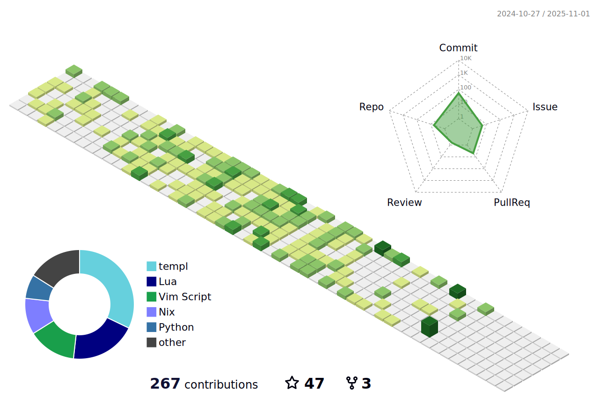

<section>
<h1 align="center">
    
    Hello There! I'm Gavin Kondrath
</h1>

  <a href="https://www.linkedin.com/in/gavin-kondrath/">LinkedIn</a> -
  <a href="https://www.instagram.com/gavin_kondrath/">Instagram</a> -
  <a href="https://tiktok.com/@gavin_kondrath">TikTok</a> -
  <a href="https://www.youtube.com/@GavinKondrath">YouTube</a>

</section>

 
 

<section>
    <ul>
        <li>🏠 Raised in Austin, Texas, USA</li>
        <li>🔥 Self Taught Software Engineer</li>
        <li>👩🏻‍🎓 Studied Korean language & Culture at Korea University in Seoul</li>
        <li>🏫 고려대학교 한국어교육관 다녔습니다</li>
        <li>🌏 Loves street food from around the globe</li>
        <li>🌱 Currently learning Golang + HTMX</li>
    </ul>
</section>

 

<a href="https://www.python.org/" target="_blank" rel="noreferrer"><picture>
 <source media="(prefers-color-scheme: dark)" srcset="https://raw.githubusercontent.com/danielcranney/readme-generator/main/public/icons/skills/python-dark.svg">
 <source media="(prefers-color-scheme: light)" srcset="https://raw.githubusercontent.com/danielcranney/readme-generator/main/public/icons/skills/python-colored.svg">
 
</picture></a>
<a href="https://go.dev/" target="_blank" rel="noreferrer"><picture>
 <source media="(prefers-color-scheme: dark)" srcset="https://raw.githubusercontent.com/danielcranney/readme-generator/main/public/icons/skills/go-dark.svg">
 <source media="(prefers-color-scheme: light)" srcset="https://raw.githubusercontent.com/danielcranney/readme-generator/main/public/icons/skills/go-colored.svg">
 
</picture></a>
<a href="https://www.typescriptlang.org/" target="_blank" rel="noreferrer"><picture>
 <source media="(prefers-color-scheme: dark)" srcset="https://raw.githubusercontent.com/danielcranney/readme-generator/main/public/icons/skills/typescript-dark.svg">
 <source media="(prefers-color-scheme: light)" srcset="https://raw.githubusercontent.com/danielcranney/readme-generator/main/public/icons/skills/typescript-colored.svg">
 
</picture></a>
<a href="https://tailwindcss.com/" target="_blank" rel="noreferrer"><picture>
 <source media="(prefers-color-scheme: dark)" srcset="https://raw.githubusercontent.com/danielcranney/readme-generator/main/public/icons/skills/tailwindcss-dark.svg">
 <source media="(prefers-color-scheme: light)" srcset="https://raw.githubusercontent.com/danielcranney/readme-generator/main/public/icons/skills/tailwindcss-colored.svg">
 
</picture></a>
<a href="https://react.dev/" target="_blank" rel="noreferrer"><picture>
 <source media="(prefers-color-scheme: dark)" srcset="https://raw.githubusercontent.com/danielcranney/readme-generator/main/public/icons/skills/react-dark.svg">
 <source media="(prefers-color-scheme: light)" srcset="https://raw.githubusercontent.com/danielcranney/readme-generator/main/public/icons/skills/react-colored.svg">
 
</picture></a>
<a href="https://git-scm.com/" target="_blank" rel="noreferrer"><picture>
 <source media="(prefers-color-scheme: dark)" srcset="https://raw.githubusercontent.com/danielcranney/readme-generator/main/public/icons/skills/git-dark.svg">
 <source media="(prefers-color-scheme: light)" srcset="https://raw.githubusercontent.com/danielcranney/readme-generator/main/public/icons/skills/git-colored.svg">
 
</picture></a>
<a href="https://www.docker.com/" target="_blank" rel="noreferrer"><picture>
 <source media="(prefers-color-scheme: dark)" srcset="https://raw.githubusercontent.com/danielcranney/readme-generator/main/public/icons/skills/docker-dark.svg">
 <source media="(prefers-color-scheme: light)" srcset="https://raw.githubusercontent.com/danielcranney/readme-generator/main/public/icons/skills/docker-colored.svg">
 
</picture></a>
<a href="https://www.linux.org" target="_blank" rel="noreferrer"><picture>
 <source media="(prefers-color-scheme: dark)" srcset="https://raw.githubusercontent.com/danielcranney/readme-generator/main/public/icons/skills/linux-dark.svg">
 <source media="(prefers-color-scheme: light)" srcset="https://raw.githubusercontent.com/danielcranney/readme-generator/main/public/icons/skills/linux-colored.svg">
 
</picture></a>
<a href="https://www.vim.org/" target="_blank" rel="noreferrer"><picture>
 <source media="(prefers-color-scheme: dark)" srcset="https://raw.githubusercontent.com/danielcranney/readme-generator/main/public/icons/skills/vim-dark.svg">
 <source media="(prefers-color-scheme: light)" srcset="https://raw.githubusercontent.com/danielcranney/readme-generator/main/public/icons/skills/vim-colored.svg">
 
</picture></a>

