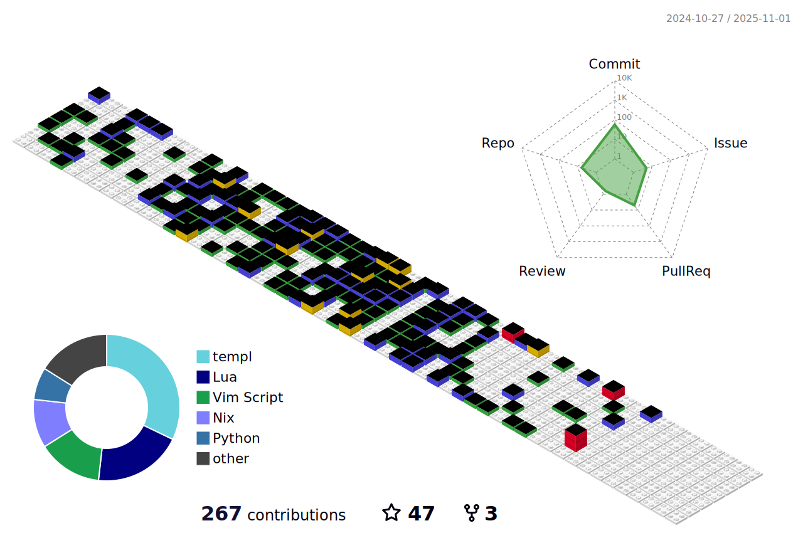

<h1 align="center">👋 Hello! I'm Gavin Kondrath</h1>

  <a href="https://www.linkedin.com/in/gavin-kondrath/">LinkedIn</a> •
  <a href="https://www.instagram.com/gavin_kondrath/">Instagram</a> •
  <a href="https://tiktok.com/@gavin_kondrath">TikTok</a> •
  <a href="https://www.youtube.com/@GavinKondrath">YouTube</a>

I love Golang, Jakarta, & Spicy food

<strong>About me</strong>
- 🠠Raised in Austin, Texas, USA 
- 🔥 Self Taught Software Engineer 
- 👩🏻‍🎓 Studied Korean language & Culture at Korea University in Seoul 
- 🏫 고려대학교 한국어교육관 다녔습니다 
- 🌠Loves eating street food from around the globe 
- 🌱 Currently learning Golang + HTMX 

